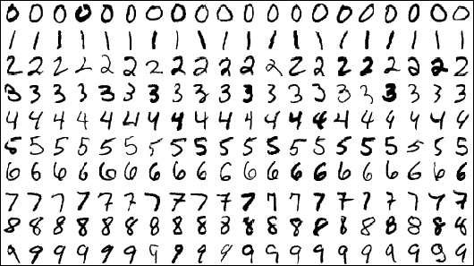

# Handwritten-digit-recognition-MNIST

Handwritten Digit Recognition using Convolutional Neural Networks in Python with Keras

## MNIST dataset:

MNIST is a collection of handwritten digits from 0-9. Image of size 28 X 28

## Description:

This is a 8 layers Sequential Convolutional Neural Network for digits recognition trained on MNIST dataset. I choosed to build it with keras API (Tensorflow backend) which is very intuitive.

It achieved 84.57% of accuracy with this CNN trained on a CPU, which took me about a 5-10minute. If you dont have a GPU powered machine it might take a little longer, you can try reducing the epochs (steps) to reduce computation.

 

## Code Requirements:

python 3.x with following modules installed

1. numpy
2. keras
3. opencv2

## Execution:

`pip install -r requirements.txt`

`python model.py`

`python run.py`

## Built With
* [Keras](https://keras.io/about/) - Keras is a deep learning API
* [Opencv2](https://opencv.org/) - open-source computer vision library

## Purpose
The purpose of this project was to gain introductory exposure to Deep Learning Classification concepts. The project makes heavy use of Keras(tensorflow in backend) and Opencv2 Libraries.

## Contributing
Pull requests are welcome. For major changes, please open an issue first to discuss what you would like to change.

Please make sure to update tests as appropriate.

## License

[MIT](https://choosealicense.com/licenses/mit/)
